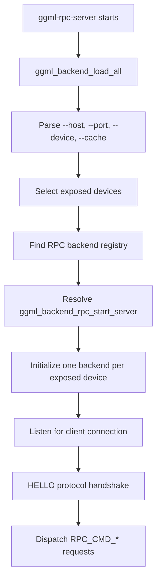
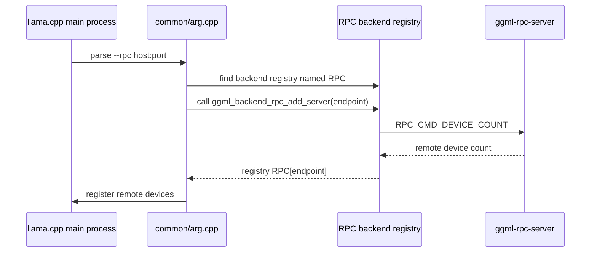
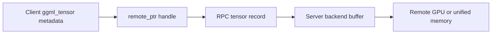
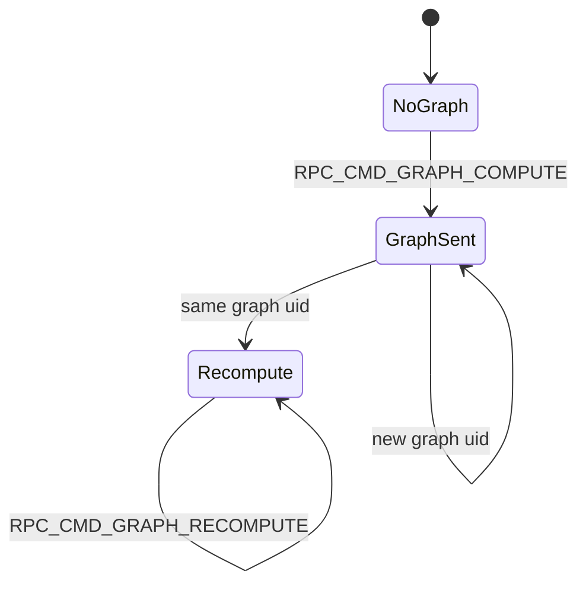

# RPC Backend Flow

Reviewed against upstream `192067b72` and the private-fork merge resolution of 2026-08-27.

## What RPC Is

The RPC backend lets one llama.cpp process use devices that live in another process, possibly on another host. The remote process is `ggml-rpc-server`. It exposes local ggml backend devices such as CUDA, Metal, or CPU through a binary RPC protocol.

The main process still controls:

- command-line parsing
- model loading
- tensor placement decisions
- graph construction
- backend scheduling
- sampling and output handling

The remote server controls:

- remote backend initialization
- remote buffer allocation
- remote tensor writes and reads
- remote graph execution for graph fragments assigned to that remote backend

## Server Startup

`tools/rpc/rpc-server.cpp` starts the standalone server. It loads all compiled backends, selects devices, resolves `ggml_backend_rpc_start_server()`, and starts listening.



Important server controls:

- `--host`: bind address. Keep this on a trusted network only.
- `--port`: listen port, default `50052`.
- `--device`: expose only selected devices.
- `--cache`: enable local tensor cache for large model tensors.
- `--threads`: CPU backend thread count if CPU is exposed.

## Client Registration

The main process adds RPC devices when `--rpc` is parsed.



After registration, RPC devices look like normal ggml GPU devices to the model loader and scheduler. This is why the same multi-GPU flags also affect RPC devices.

## Protocol Shape

The RPC protocol is binary. A request sends:

```text
cmd byte | request size | request payload
```

Some commands receive:

```text
response size | response payload
```

The important command groups are:

- device queries: device count, memory, alignment, max buffer size
- buffer lifecycle: allocate, free, clear
- tensor transfer: set tensor, get tensor, copy tensor
- graph execution: graph compute, graph recompute
- cache support: set tensor hash for large tensors

This private fork uses protocol `7.0.0`. The major version differs from upstream because the fork adds a `cache_write` byte to `RPC_CMD_SET_TENSOR`. A fork client and server must therefore be built from the same compatible source. The `HELLO` handshake rejects peers with a different major version before tensor traffic begins.

## Dispatcher And Ordering

Each endpoint has one shared `rpc_dispatcher`. Callers enqueue commands, and a worker thread performs socket I/O in queue order.

- `send()` enqueues a command and waits for its completion.
- `send_async()` enqueues a command and returns.
- `synchronize()` enqueues a fence and waits for all earlier commands.
- RPC events are queue fences backed by futures, not simulated no-op events.

Graph compute, graph recompute, and backend async tensor operations use `send_async()`. Buffer-interface tensor operations remain synchronous. A later dependent read or synchronization point waits for earlier queued remote work.

The RPC device now reports async and event support unconditionally. The former private `GGML_RPC_PIPELINE` fake-event experiment was removed during the upstream merge.

## Transport Selection

The command protocol runs over the transport selected during `HELLO`. TCP is always available. If both peers were built with RDMA support and advertise compatible capabilities, the connection upgrades automatically; otherwise it stays on TCP. Set `GGML_RPC_NO_RDMA=1` on either peer to force TCP.

Current RDMA implementations cover Linux RoCE/InfiniBand through `libibverbs` and Apple silicon RDMA over Thunderbolt through `librdma`. Apple RDMA requires supported Thunderbolt hardware, macOS 26.2 or later, and one-time enablement from Recovery.

## What Stays Remote

Remote backend buffers stay in the server process. The client holds remote pointer handles and uses them only as identifiers in later RPC messages.



The client serializes tensor metadata. The server reconstructs temporary ggml tensors around remote buffers and executes backend operations locally.

## Graph Reuse

For graph execution, the first run sends the serialized graph. If the graph UID matches the previous graph for that remote device, later runs can send `RPC_CMD_GRAPH_RECOMPUTE`.



This matters for token generation. Reusing the graph avoids resending all graph metadata. Both graph commands are now queued asynchronously, but dependency boundaries can still force a later tensor read or event synchronization to wait for remote completion.
