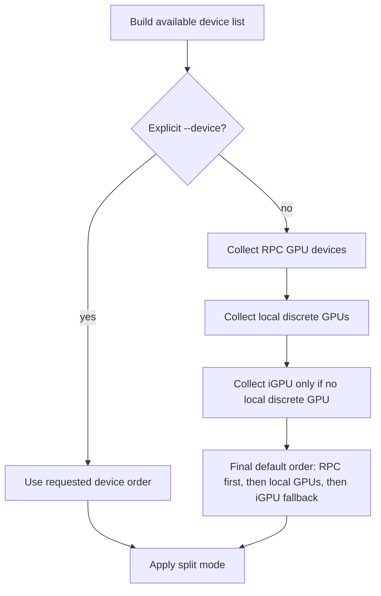
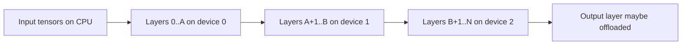

# Weight Placement

Reviewed against upstream `192067b72` and the private-fork merge resolution of 2026-08-27.

## Control Knobs

The main user-facing controls are shared with normal multi-GPU runs.

| Option | Meaning |
|---|---|
| `--rpc host:port,...` | Adds remote RPC devices. |
| `--device dev1,dev2,...` | Restricts and orders devices used for offload. Use `--list-devices` to discover names. |
| `--split-mode layer` | Default. Assigns contiguous layer ranges to devices. |
| `--split-mode none` | Uses one device only, selected by `--main-gpu`. |
| `--split-mode tensor` | Experimental tensor parallel mode through a meta device. Not the first choice over LAN RPC. |
| `--tensor-split N0,N1,...` | Overrides automatic split proportions. Values follow device order. |
| `--n-gpu-layers N`, `--n-gpu-layers all` | Controls how many transformer layers plus output layer can be offloaded. |
| `--kv-offload`, `--no-kv-offload` | Controls whether KV cache follows device placement or stays local. |
| `--override-tensor PATTERN=BUFT` | Advanced per-tensor buffer override. |

Private-fork environment controls:

| Variable | Meaning |
|---|---|
| `LLAMA_RPC_SPLIT_SCALE` | Scales reported free memory for RPC devices during automatic placement. It does not alter explicit `--tensor-split` values. |
| `LLAMA_OUTPUT_LAYER_DEVICE` | Selects a named offload device for final norm and the output head without moving repeating layers or KV placement. |

## Device Selection

When devices are not specified explicitly, llama.cpp enumerates available devices and handles RPC devices specially.



RPC devices are inserted before local GPUs in the default order. In layer split mode, that means early layers tend to be placed on RPC devices unless `--device` or `--tensor-split` changes the outcome.

## Layer Split Mode

In `--split-mode layer`, llama.cpp assigns whole layers to devices. The split is contiguous: a device gets a range of layers, then the next device gets the next range.



The input layer is kept on CPU. The output layer is treated as one extra offloadable layer.

The split algorithm:

1. Build a list of device proportions.
2. If `--tensor-split` is not set, use each device's reported free memory.
3. Normalize the proportions into cumulative split points.
4. Compute `i_gpu_start = max(n_layer_all + 1 - n_gpu_layers, 0)`.
5. Keep layers before `i_gpu_start` on CPU.
6. Assign remaining repeating layers and the output layer across devices by split point.

## Why Free Memory Can Be Misleading

The default split optimizes for fitting the model, not for equal time per layer. A MacBook with 24 GB unified memory may receive many layers because it reports more available memory than the 2060S. That can be bad for token generation if the Mac backend or network link is slower than the 4070 Ti Super.

For your setup, `--tensor-split` is the main manual control. First discover actual device order:

```sh
llama-cli --rpc <mac-host>:50052 --list-devices
```

Then test proportions in that order. If the order is:

```text
RPC0, CUDA0, CUDA1
```

then:

```sh
--tensor-split 2,2,6
```

means roughly 20 percent to `RPC0`, 20 percent to `CUDA0`, and 60 percent to `CUDA1`.

Use those values as experiments, not as fixed recommendations. The best split is the one that fits memory while reducing time spent on the slowest device and reducing expensive boundaries.

The upstream async RPC merge does not change these placement rules. It can overlap queued work when dependencies allow, but it does not make a poor layer split inexpensive.
