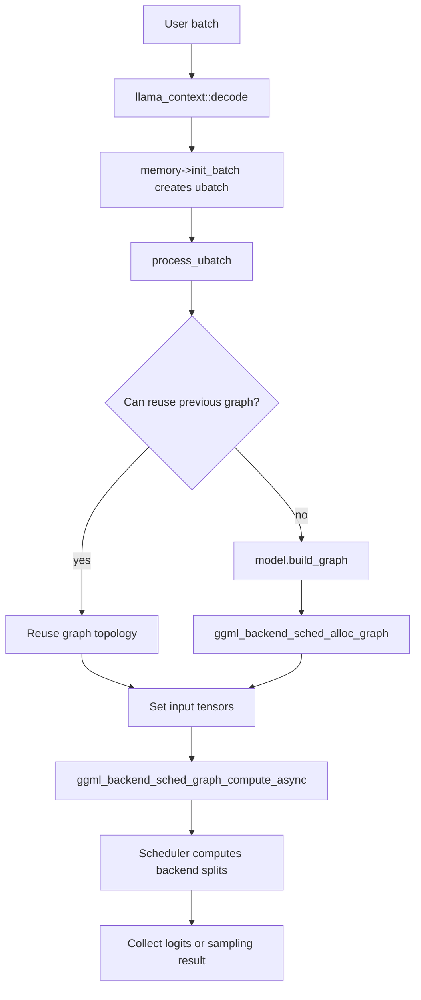
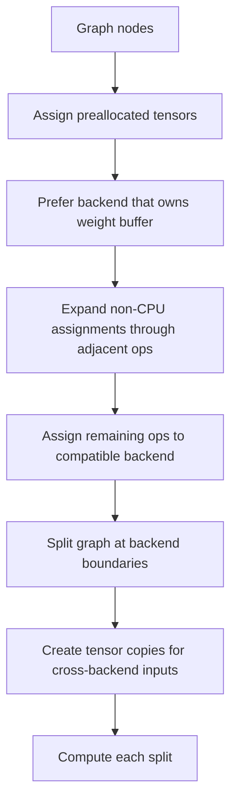
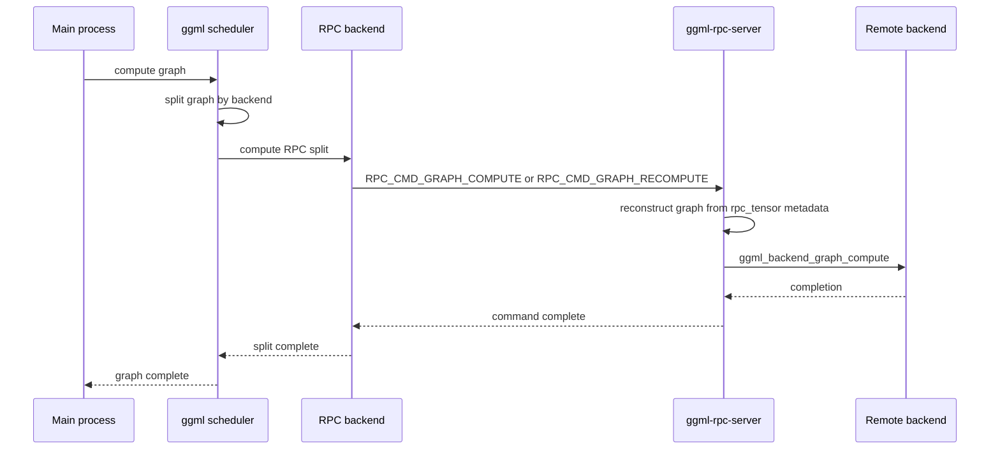

# Inference Execution

Traceability source commit: `b89f44654161`

## Main Flow

The main inference path goes through `llama_decode()`, batch splitting, graph construction or reuse, scheduler allocation, and backend graph execution.

Prompt processing and token generation use the same machinery, but they have different shapes:

- Prompt processing uses larger ubatches. There is more compute per scheduling and RPC round trip.
- Token generation often processes one new token per sequence. There is less compute per round trip, so latency dominates more easily.

## Scheduler Splits

The ggml backend scheduler assigns each graph node to a backend. Weight buffers strongly influence placement: an operation with a weight tends to run on the backend that owns that weight.

When a split needs data from another backend, the scheduler inserts a copy into the destination backend. With RPC, these copies are especially important because they can become network transfers.

## RPC Graph Compute

When a scheduler split is assigned to an RPC backend, the RPC backend serializes the graph fragment and sends it to the remote server.

The remote server does not sample tokens and does not own the full llama context. It only executes the ggml graph fragment it receives.

## Pipeline Parallelism And RPC

llama.cpp has a pipeline-parallel path for layer split mode, but it requires async compute and events on all non-CPU devices. The RPC backend currently reports no async/event support. That means pipeline parallelism is effectively disabled when RPC devices participate.

This is a key reason token generation can be slow over RPC. The system can place layers remotely, but it cannot overlap remote and local stages the way a lower-latency multi-GPU setup might.
