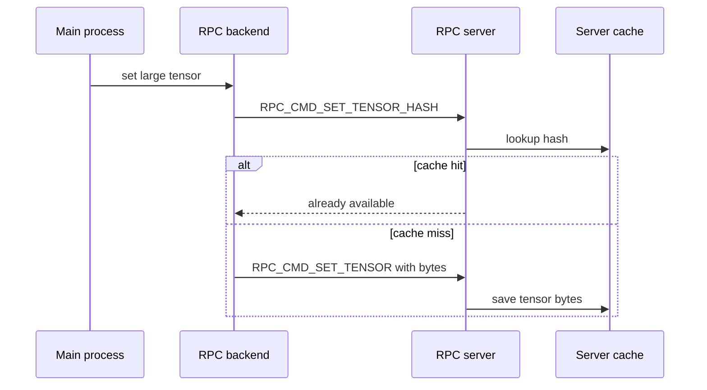
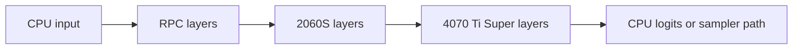
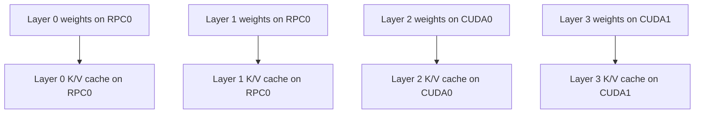

# Data Movement And KV Cache

Traceability source commit: `b89f44654161`

## What Moves Over RPC

RPC traffic falls into four broad groups.

| Phase | Data over RPC |
|---|---|
| Startup | Device count, memory, alignment, max buffer size. |
| Model load | Remote buffer allocation and tensor bytes for remote weights. |
| Inference | Serialized graph metadata, cross-backend activations, graph recompute commands. |
| Output | Tensors read back when the main process needs logits, embeddings, or sampled token data. |

Large tensor transfer uses a hash check first when the data is larger than 10 MiB. If the remote server cache is enabled and already has that hash, the full tensor bytes do not need to be sent again.

Use `ggml-rpc-server --cache` on the remote host to enable this.

## Boundary Copies

In layer split mode, activations must cross device boundaries between contiguous layer ranges.

Each boundary can require a tensor copy. If a boundary crosses the network, it is much more expensive than a local device-to-device copy.

The goal is not just to fit the model. The goal is to fit the model while keeping:

- few cross-network boundaries
- enough layers on fast local GPUs
- KV cache colocated with the layers that use it
- token generation latency low

## KV Cache Placement

With KV offload enabled, KV tensors are allocated using the device for each layer. In layer split mode, this means a layer's KV cache usually lives on the same backend as that layer's weights.

That is usually what you want. If weights are remote but KV is local, attention can force extra movement or less favorable scheduling.

Inputs such as positions, KV indices, and attention masks are host-side inputs. They still need to be made available to the backend split that consumes them.

## How Much Is Distributed

Distributed:

- model weight buffers assigned to RPC devices
- KV cache for layers assigned to RPC devices, if KV offload is enabled
- graph fragments assigned to RPC devices
- tensor operations in those fragments

Not distributed:

- command-line parsing
- model placement decisions
- graph construction
- scheduler decisions
- user request handling
- final token sampling unless backend sampling path applies and stays compatible
