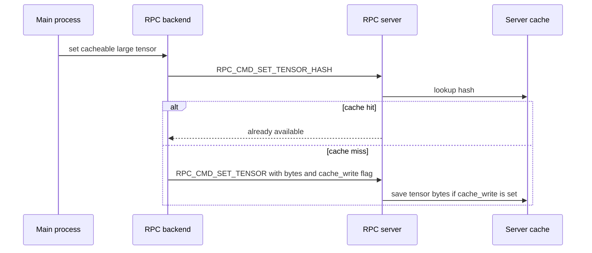
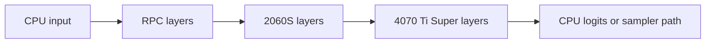
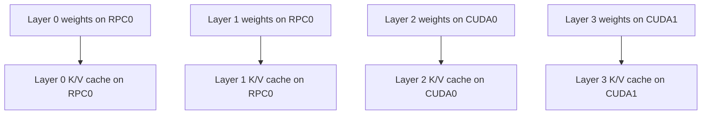

# Data Movement And KV Cache

Reviewed against upstream `192067b72` and the private-fork merge resolution of 2026-08-27.

## What Moves Over RPC

RPC traffic falls into four broad groups.

| Phase | Data over RPC |
|---|---|
| Startup | Device count, memory, alignment, max buffer size. |
| Model load | Remote buffer allocation and tensor bytes for remote weights. |
| Inference | Serialized graph metadata, cross-backend activations, graph recompute commands. |
| Output | Tensors read back when the main process needs logits, embeddings, or sampled token data. |

Large tensor transfer can use a hash check first when the data is larger than 10 MiB. If the remote server cache is enabled and already has that hash, the full tensor bytes do not need to be sent again.

Use `ggml-rpc-server --cache` on the remote host to give the server a cache directory. The client-side `GGML_RPC_CACHE_SCOPE` setting decides which uploads should use that cache protocol:

- `all`: default behavior. Hash and cache any large tensor upload.
- `weights`: hash and cache only buffers marked `GGML_BACKEND_BUFFER_USAGE_WEIGHTS`.
- `none`: do not use the RPC cache protocol from the client.

`--cache` and `GGML_RPC_CACHE_SCOPE` are separate controls. `--cache` says the server can read and write cached tensor files. `GGML_RPC_CACHE_SCOPE` says which client uploads are worth checking and saving. For the Qwen3.6 RPC investigation, use `GGML_RPC_CACHE_SCOPE=weights` with `ggml-rpc-server --cache` first: it keeps warm weight loads but avoids cache writes for transient prompt-processing tensors.

On a cache miss, the client still sends `RPC_CMD_SET_TENSOR` with the tensor bytes. The server writes a cache file only when the `cache_write` flag is set, but it always calls `ggml_backend_tensor_set()` with the payload data.

Both the synchronous buffer path and the backend asynchronous tensor path apply the same cache-scope decision and send the same payload layout. Because `cache_write` changes the wire format, this fork uses RPC protocol `7.0.0`; use matching fork builds on both ends.

The hash lookup currently remains synchronous even when the following tensor upload is queued asynchronously. This is necessary because the client must know whether a full upload is needed. On a miss, the async path enqueues the payload and returns; queue ordering keeps it behind earlier commands.

## Boundary Copies

In layer split mode, activations must cross device boundaries between contiguous layer ranges.

Each boundary can require a tensor copy. If a boundary crosses the network, it is much more expensive than a local device-to-device copy.

The goal is not just to fit the model. The goal is to fit the model while keeping:

- few cross-network boundaries
- enough layers on fast local GPUs
- KV cache colocated with the layers that use it
- token generation latency low

## KV Cache Placement

With KV offload enabled, KV tensors are allocated using the device for each layer. In layer split mode, this means a layer's KV cache usually lives on the same backend as that layer's weights.

That is usually what you want. If weights are remote but KV is local, attention can force extra movement or less favorable scheduling.

Inputs such as positions, KV indices, and attention masks are host-side inputs. They still need to be made available to the backend split that consumes them.

## How Much Is Distributed

Distributed:

- model weight buffers assigned to RPC devices
- KV cache for layers assigned to RPC devices, if KV offload is enabled
- graph fragments assigned to RPC devices
- tensor operations in those fragments

Not distributed:

- command-line parsing
- model placement decisions
- graph construction
- scheduler decisions
- user request handling
- final token sampling unless backend sampling path applies and stays compatible
