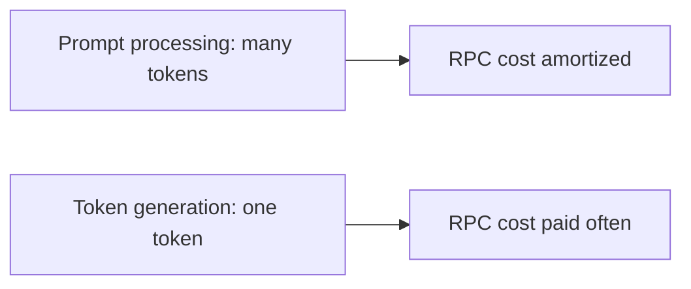

# Performance Bottlenecks

Traceability source commit: `b89f44654161`

Your current numbers, about 150 tokens/s prompt processing and 12 tokens/s token generation, are plausible for a setup where prompt processing has enough work per batch to hide some overhead, while token generation is dominated by latency, synchronization, and the slowest layer segment.

The current RPC path goes over LAN through a USB-C Ethernet adapter and the router. Treat that link as part of the compute path, not only as model-load plumbing. Any layer boundary that crosses between the Linux host and the MacBook can put activation copies and synchronization on this network path.

## Main Bottlenecks

### 1. Token Generation Has Little Work Per Round Trip

Prompt processing computes many tokens at once. Token generation often computes one token at a time. A fixed RPC cost hurts token generation much more.



### 2. RPC Is Blocking

The RPC backend currently does not expose async tensor set/get/copy, graph plans, or events. The scheduler can fall back to blocking copies and synchronization.

Consequence:

- less overlap between local and remote work
- network latency matters more
- pipeline parallelism is disabled when RPC participates

### 3. Cross-Backend Boundaries Move Activations

Each transition from one device's layer range to the next can move intermediate activations. Local PCIe transfers are already costly; network transfers are worse.

For default device order, RPC devices are first. That can be good because the remote segment stays contiguous at one end of the layer stack, but it can still be bad if too many layers land on a slower remote device.

### 4. Free-Memory Splitting Ignores Speed

The default layer split uses reported free memory when `--tensor-split` is not provided. It does not know that your 4070 Ti Super is much faster than the MacBook GPU, or that the MacBook is behind a network link.

This can over-assign work to the remote host.

### 5. Model Load Can Be Network Heavy

Weights assigned to the RPC device must become remote buffers. Without `ggml-rpc-server --cache`, large tensors are sent over the network on each cold load.

### 6. Output Readback And Sampling

If the main process needs logits or other outputs on the host, tensors must come back from the backend that produced them. For normal generation, this is smaller than moving weights, but for token generation it is on the latency path.

## Improvement Opportunities

For your current `llama-server` command, read [Launch command analysis](08-launch-command-analysis.md) before using the generic split examples below. Your command explicitly uses `--device CUDA0,CUDA1,RPC0`, so the split and `--fit-target` order differs from RPC-first examples.

## Impact-Ordered Improvement Plan

### 1. Reduce The MacBook Share With `--tensor-split`

Likely impact: high.

This is the first lever to try. The default split uses free memory, not speed. A 24 GB MacBook can receive too much work relative to the 4070 Ti Super. Use `--tensor-split` to keep enough layers on the MacBook to fit the model, but no more.

If device order is:

```text
RPC0, CUDA0, CUDA1
```

try splits such as:

```text
--tensor-split 2,2,6
--tensor-split 1,2,7
--tensor-split 1,1,8
```

Stop when the model no longer fits, or when token generation gets worse.

### 2. Test Whether RPC Helps Throughput Or Only Capacity

Likely impact: high for decision quality.

Run a local-only baseline. If the model can fit mostly or fully on the Linux GPUs, RPC may reduce token generation speed even if it increases total available memory. If the model needs the MacBook to fit, the goal becomes minimizing the MacBook layer share.

### 3. Improve The Network Path

Likely impact: medium to high if the current link is 1 GbE or has high latency.

Check the negotiated link speed on both ends. A USB-C Ethernet adapter through a router is commonly 1 GbE unless the adapter, router, and port are all faster. If RPC must remain in the token path, prefer:

- direct wired connection or a good dedicated switch instead of a busy router path
- 2.5 GbE, 5 GbE, or 10 GbE adapters if both hosts can support it
- no Wi-Fi anywhere in the path
- no USB hub sharing bandwidth with other devices

This helps model load, activation boundary copies, and RPC round-trip cost. It will not remove the fact that RPC token generation is latency-sensitive.

### 4. Keep RPC Layers Contiguous And At One End

Likely impact: medium.

Avoid device orders that put the MacBook between local GPUs in layer order. The default order puts RPC first, which usually keeps remote layers at one end. If using `--device`, keep the RPC device at the start or end of the list and avoid alternating local and remote devices.

### 5. Use `ggml-rpc-server --cache`

Likely impact: high for repeated load time, low for steady-state tokens/s.

This avoids resending large tensors that the MacBook already cached. It mainly improves startup and iteration time, not token generation speed after the model is loaded.

With the private-fork cache scope patch, prefer `GGML_RPC_CACHE_SCOPE=weights` when the server uses `--cache`. This preserves cached weight loads while stopping large transient inference tensors from doing cache hash checks and cache file writes. Use `GGML_RPC_CACHE_SCOPE=none` only as a diagnostic, or when the server is not using `--cache` and client-side hash probes are wasted.

### 6. Test KV Offload

Likely impact: medium, workload-dependent.

Default KV offload should usually be better because the KV cache follows the layer device. Still, test `--no-kv-offload` once. If it improves token generation, the current split is probably causing expensive remote KV or scheduler movement.

### 7. Tune Batch Settings For Prompt Processing

Likely impact: medium for prompt processing, low for single-stream token generation.

Prompt processing can benefit from larger batches if memory allows. Token generation for one stream is usually limited by per-token latency and the slowest distributed stage.

### 8. Code-Level RPC Async And Events

Likely impact: high, but high implementation cost.

The RPC backend currently has no async tensor copy, no backend events, and no graph plans. Because of that, scheduler copies and graph execution can become blocking, and pipeline parallelism is disabled when RPC participates. Adding async/event support is the largest architectural performance opportunity.

### 9. Code-Level Placement Improvements

Likely impact: medium to high, high implementation cost.

The current automatic split is memory-based. A better placement model would use measured backend speed, network bandwidth, network latency, and layer cost. That could avoid assigning too much token-generation work to a slower remote host.

### 10. Code-Level RPC Serialization Improvements

Likely impact: medium.

RPC uses temporary buffers for graph and tensor payloads. Reducing copies and improving transfer paths can help, but it is probably less important than reducing remote layer share and adding async/event support.

## Older Short-Term Checklist

Short-term tuning:

- Use `--tensor-split` to bias fewer layers to the MacBook and more to the 4070 Ti Super, while still fitting memory.
- Keep RPC layers contiguous by avoiding device orders that put RPC in the middle.
- Use `ggml-rpc-server --cache` on the MacBook.
- Compare with and without the MacBook to see whether it improves capacity only or also throughput.
- Keep KV offload enabled unless you are testing a specific hypothesis.
- Increase prompt batch size only if memory allows and it improves prompt processing.

Code-level opportunities:

- async/event support for RPC backend so pipeline parallelism can work
- async RPC tensor copy support
- fewer temporary copies in RPC serialization
- better remote op support query and caching
- smarter placement that accounts for measured device speed and network cost, not only free memory
- better graph split shaping to reduce remote boundaries

The most practical first investigation is not code. It is measuring several `--tensor-split` values and looking for the best token generation speed that still fits the model.
