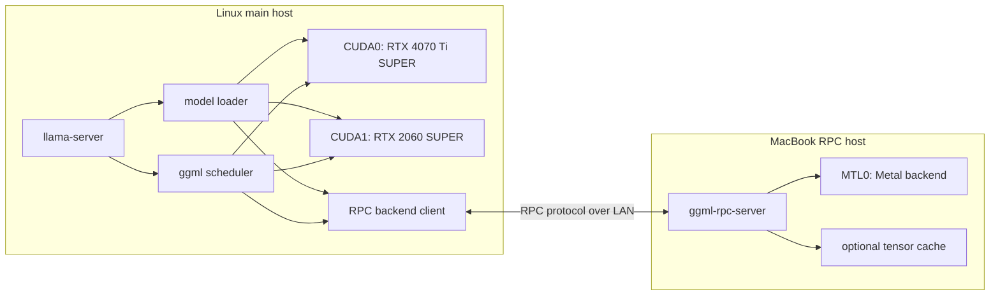
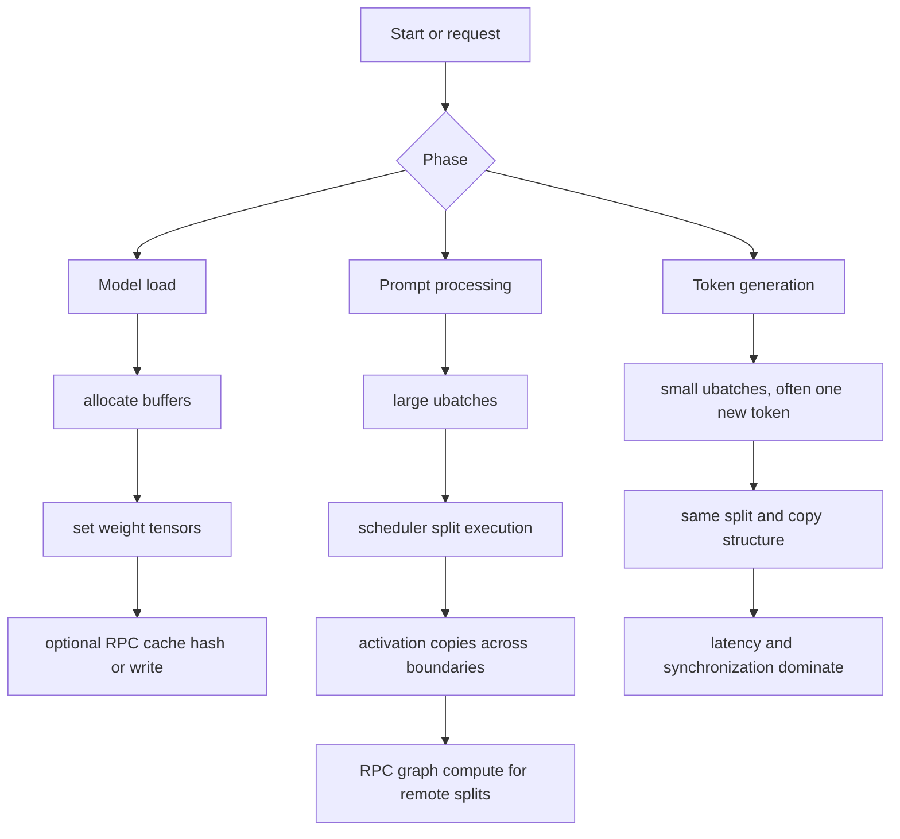
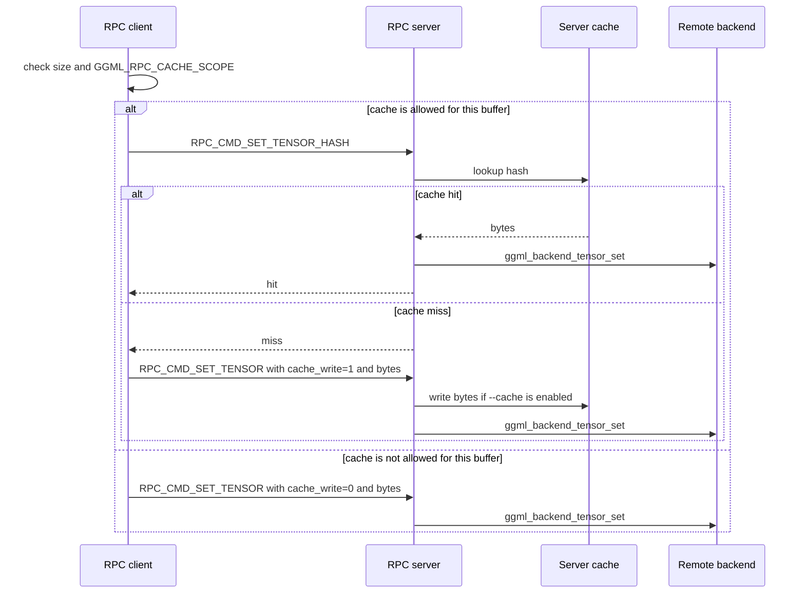
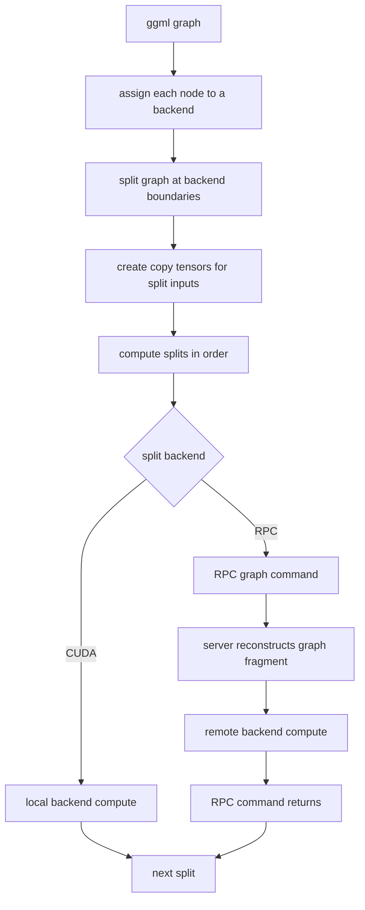
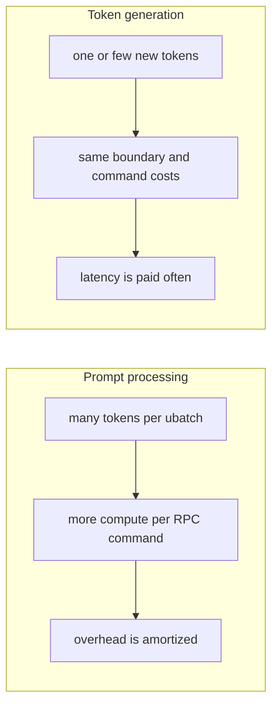
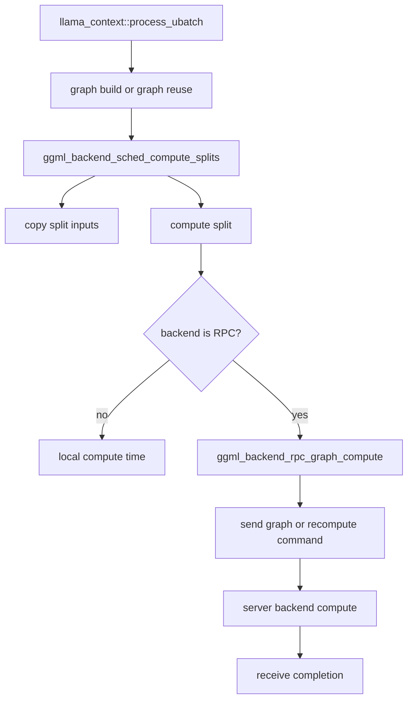
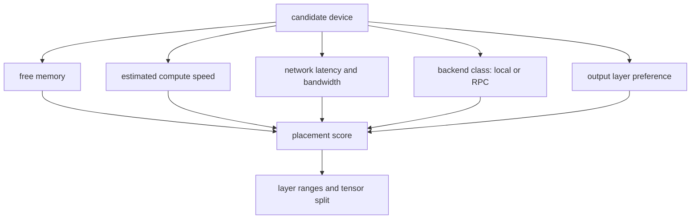
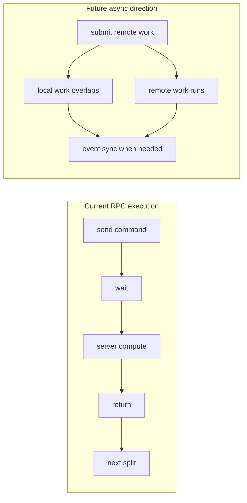
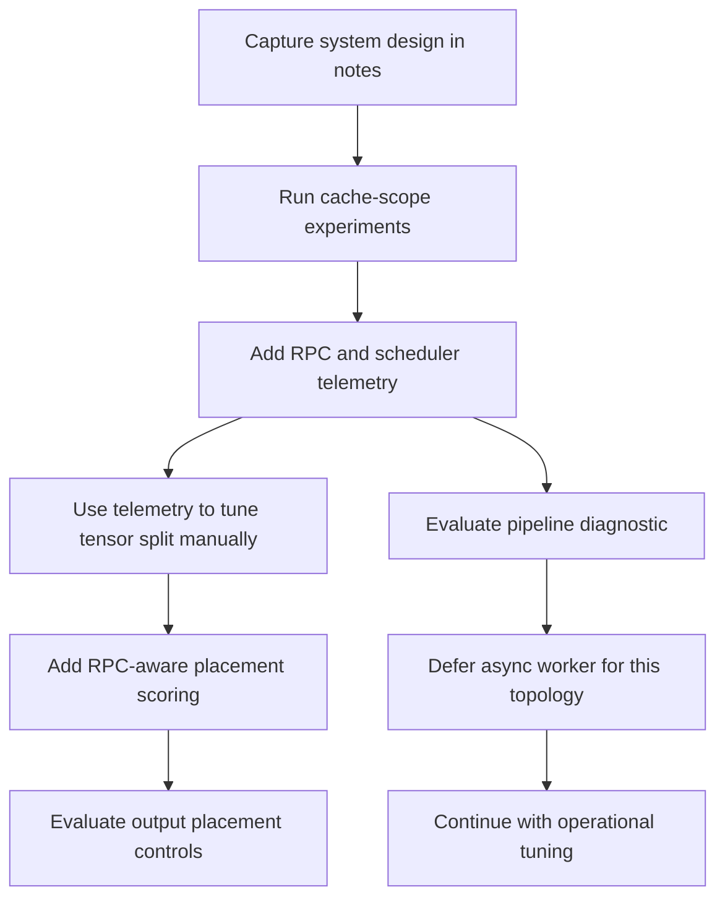

# RPC Performance System Design

Traceability source commit: `59abc3967`

This page captures the system design before more RPC performance changes. The goal is to make the moving parts visible, then break the work into small private-fork changes.

## Design Goals

- Keep the current RPC model: the main llama.cpp process owns inference, the RPC server exposes remote ggml devices.
- Make performance visible before changing placement or execution behavior.
- Keep private-fork changes small enough to understand and test.
- Prefer controls that preserve current behavior by default.
- Optimize for the observed setup first: Linux host with `CUDA0`, `CUDA1`, and MacBook `RPC0` over wired 1 GbE.

## Current Private Fork Outcome

This investigation reached a useful private-fork stop point. The setup is worth continuing to use, especially for long-context runs where the MacBook RPC device helps the model fit. Prompt processing is good enough for the target workflow, and token generation improved from about 8 tokens/s to about 10-12 tokens/s with the current placement and cache changes.

Current useful launch shape:

```text
--rpc 192.168.0.118:50052 --device CUDA0,CUDA1,RPC0 --tensor-split 6.5,3,6.5
```

Useful environment:

```text
GGML_RPC_CACHE_SCOPE=weights
LLAMA_OUTPUT_LAYER_DEVICE=CUDA0
```

The private switches remain operational controls and diagnostics while this fork continues to take upstream llama.cpp changes. Keep them small and easy to rebase. Do not treat them as an upstream-ready feature set without a separate design pass.

The main performance conclusion is that `RPC0` is useful for capacity but slow as a required token-generation stage. Telemetry showed the MacBook Metal recompute takes about 50 ms, and the Linux client then waits about 52-53 ms in `get_tensor` for a tiny `norm` tensor of 20480 bytes. That wait is dependency and server-completion time, not network bandwidth.

## Current Runtime Shape



RPC is not a remote llama server. The MacBook does not own tokenization, sampling, context state, or the whole model graph. It owns remote buffers and runs graph fragments assigned to its exposed backend.

## Performance Phases



Prompt processing can hide some RPC cost because it has more work per ubatch. Token generation repeats the same distributed execution path with much less work per step, so fixed RPC costs hurt more.

## RPC Cache Policy

`ggml-rpc-server --cache` is server capability. It means the server has a cache directory and can read or write cached tensor files.

`GGML_RPC_CACHE_SCOPE` is client policy. It decides which client tensor uploads should use the cache protocol.



Use `GGML_RPC_CACHE_SCOPE=weights` first with `ggml-rpc-server --cache`. This keeps warm model-weight loads but stops transient inference tensors from doing cache hash checks and cache file writes. Use `none` as a diagnostic or when the server does not use `--cache`.

## Scheduler Split Execution



The important behavior is that split boundaries can move activations between devices. With RPC, a boundary can become a network transfer. The current RPC backend does not expose async events, so the scheduler cannot fully overlap remote and local pipeline stages.

## Why Token Generation Is Harder



This is why a split can improve long prompt ingestion but still reduce interactive token generation speed. The useful split depends on whether the workload is prompt-heavy, generation-heavy, or mixed.

## Telemetry Design

The next design step should add timing data before changing placement logic. The telemetry should answer what each split costs and where time moves when flags change.



Useful fields:

- phase: prompt processing or token generation
- ubatch size and graph reuse state
- split index and backend name
- copied bytes into each split
- copy time
- backend compute time
- RPC command time
- RPC graph mode: full graph send or graph recompute
- RPC cache event: disabled, skipped by scope, hash miss, hash hit, cache write

The first telemetry version should be opt-in and log-only. It should not change scheduling behavior.

`GGML_RPC_TELEMETRY=1` also keeps aggregate counters and prints `rpc_telemetry: summary ...` lines when the process exits normally. These summaries group scheduler split time by backend, RPC graph client time by backend and graph mode, RPC server compute time by backend and graph mode, and cache traffic by side, event, and usage. They are process totals, not per request totals. If the process is killed before normal shutdown, summarize the raw telemetry log with the bash commands in [Tuning experiments](06-tuning-experiments.md).

## Placement Scoring Design

Current automatic split behavior is mostly memory based. For RPC, memory is not enough because a remote device has extra latency and network bandwidth cost.



A first private-fork version should not try to solve all placement. It can start with an RPC penalty or speed weight that biases fewer layers to `RPC0` while still fitting memory. Telemetry should come first so the penalty can be based on observed cost instead of guesswork.

The initial private-fork switch is `LLAMA_RPC_SPLIT_SCALE`. It is disabled by default. When unset, automatic split behavior uses reported free memory exactly as before. When set to a positive value, RPC devices count as `reported_free_memory * LLAMA_RPC_SPLIT_SCALE` for automatic placement. Values below `1.0` penalize RPC devices; for example `0.5` treats the MacBook RPC device as if it had half of its reported free memory. Explicit `--tensor-split` values are not changed by this switch.

## Output Layer Device Override

The private-fork output placement switch is `LLAMA_OUTPUT_LAYER_DEVICE`. It is disabled when unset or empty. When set, it must match one selected offload device name from `--device`, for example `CUDA0`. Unknown names fail fast and list the selected offload devices.

This is output-only placement: final norm plus output LM head. It does not move the last transformer block, the repeating layer split, KV placement, tensor split math, `n_gpu_layers`, or CLI arguments. The default output assignment still uses the synthetic layer after the repeating layers; the override only replaces the output buffer-type list with the matched device's existing list.

Use it with the existing manual split experiment:

```text
LLAMA_OUTPUT_LAYER_DEVICE=CUDA0 --rpc 192.168.0.118:50052 --device CUDA0,CUDA1,RPC0 --tensor-split 7,3,6
```

Expected verification:

- Logs show the default output device and then `LLAMA_OUTPUT_LAYER_DEVICE=CUDA0 sets output layer device = CUDA0`.
- Repeating layer assignment remains unchanged for the same `--tensor-split 7,3,6`.
- TG speed and telemetry boundary-copy bytes can be compared against the same launch without the env var.

Risk: moving output weights to `CUDA0` increases local GPU memory use. It can also add a boundary copy from the device that owns the last repeating layer to `CUDA0`; the experiment is useful only if avoiding RPC output placement is worth that cost.

## Future Async And Round-Trip Work



Async RPC copy, compute, and events remain possible future work, but the measured topology does not justify a client-side worker next. `GRAPH_RECOMPUTE` is already fire-and-forget on the client. The token-generation wait appears in the next dependent `get_tensor`, where the CUDA0 output split needs data from the RPC0 split before it can run. A client-side worker would move that wait, not remove it, unless the scheduler has independent work to run while RPC0 computes.

The first private-fork async-adjacent switch is `GGML_RPC_PIPELINE`. It is disabled by default. When set to `1`, the RPC device advertises async and event support and provides client-side no-op events so the scheduler can take its pipeline-parallel `n_copies > 1` path. It does not make RPC graph compute, tensor set/get, or tensor copy non-blocking. It does not change the RPC protocol or the server. Treat it as a diagnostic for scheduler pipeline behavior and memory pressure before building a real RPC worker-thread or protocol-level async path.

In the current measurements, `GGML_RPC_PIPELINE=1` did not materially improve token generation and increased compute-buffer pressure. Keep it off for normal use unless testing scheduler behavior.

## Consolidated Roadmap State



Completed private-fork changes:

1. RPC cache scope.
2. RPC and scheduler timing telemetry.
3. RPC-aware placement scale for automatic placement.
4. Output placement override.
5. RPC pipeline diagnostic switch.
6. `get_tensor` wait telemetry.

Deferred work:

1. Client-side async worker. It is not expected to improve the current placement because the dependent CUDA0 output split immediately needs RPC0's result.
2. Protocol-level async or server worker changes. These are larger private-fork divergences and are not justified by the current measurements.
3. Further placement and memory work. This is the likely useful direction if more TG speed is needed.

## Operational Follow-Up Checks

Use the current useful launch shape:

```text
--rpc 192.168.0.118:50052 --device CUDA0,CUDA1,RPC0 --tensor-split 6.5,3,6.5
```

The normal-use setting is:

```text
GGML_RPC_CACHE_SCOPE=weights
LLAMA_OUTPUT_LAYER_DEVICE=CUDA0
```

Use `GGML_RPC_TELEMETRY=1` only for measurement runs. Normal runs can leave telemetry off.

Optional diagnostics:

- `GGML_RPC_CACHE_SCOPE=none`: use only if cache telemetry suggests unexpected hash or write behavior.
- `GGML_RPC_PIPELINE=1`: use only to check scheduler pipeline behavior or memory pressure. It did not materially improve TG in this setup.
- `LLAMA_RPC_SPLIT_SCALE`: use only when testing automatic placement without explicit `--tensor-split`.

For placement experiments with `LLAMA_RPC_SPLIT_SCALE`, run without explicit `--tensor-split` and compare the chosen layer placement against the manual `--tensor-split 6.5,3,6.5` baseline:

```text
LLAMA_RPC_SPLIT_SCALE=0.75
LLAMA_RPC_SPLIT_SCALE=0.50
LLAMA_RPC_SPLIT_SCALE=0.25
```
