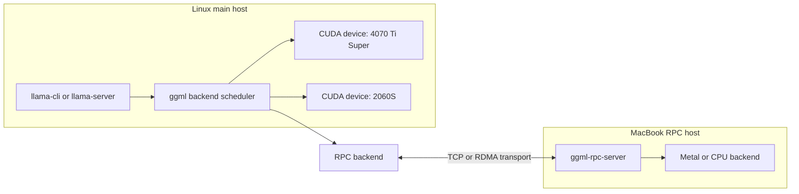

# Chapter 1: RPC Architecture

Traceability source commit: `b89f44654161`

This chapter explains how llama.cpp RPC works when the main process uses local GPUs and one or more remote devices exposed by `ggml-rpc-server`.

Your current mental model:

- Main Linux host: RTX 2060 Super + RTX 4070 Ti Super.
- Remote RPC host: MacBook with 24 GB unified memory.
- Network path: LAN through a USB-C Ethernet adapter to the router.
- Model: Qwen3.6 27B, 8 bit quant.
- Observed speed after private-fork tuning: good prompt processing and about 10-12 tokens/s token generation, improved from about 8 tokens/s.
- Current plan: keep using this private-fork setup for long-context work while continuing to take upstream llama.cpp changes.

Read in order:

1. [RPC backend flow](01-rpc-backend-flow.md)
2. [Weight placement](02-weight-placement.md)
3. [Inference execution](03-inference-execution.md)
4. [Data movement and KV cache](04-data-movement-and-kv-cache.md)
5. [Performance bottlenecks](05-performance-bottlenecks.md)
6. [Tuning experiments](06-tuning-experiments.md)
7. [Code map](07-code-map.md)
8. [Launch command analysis](08-launch-command-analysis.md)
9. [RPC performance system design](09-performance-system-design.md)
10. [RPC performance implementation plan](10-implementation-plan.md)
11. [Async RPC research report](11-async-rpc-research-report.md)

Core idea:

RPC does not make a remote machine run a full llama.cpp server for text generation. It exposes remote ggml backend devices. The main llama.cpp process still owns model loading, graph construction, scheduling, sampling, and user-facing inference. Remote devices receive tensor buffers and graph fragments, execute ggml work on their local backend, and return data when the scheduler needs it.

High-level topology:

